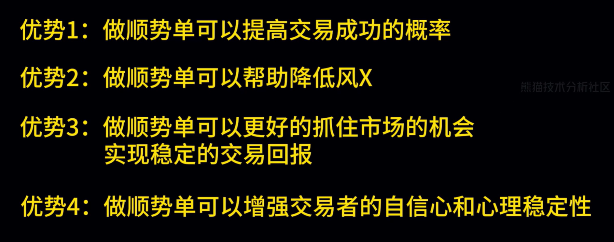

https://www.bilibili.com/video/BV1Bk4y1D79v?spm_id_from=333.788.videopod.sections&vd_source=c4cb5a808bb732e58d06c27a314f52ac

坚持做顺势单，其实是利用趋势的力量

移动止损
三线战法：在一个较强的趋势里，一般行情的回调不会超过三根k线，如果超过，那么行情反转的概率就比较大，不设置止盈，而只设置止损，止损按照新的3根k线的极值来设定
原理是以3根k线作为一个小周期

